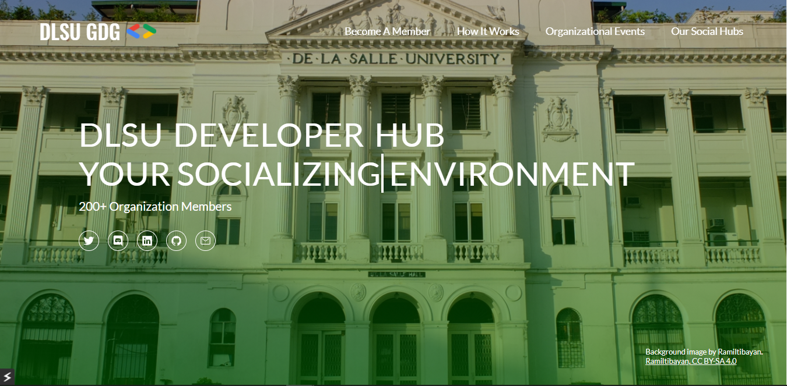

# DSC-react
The website can be visited [through this link](https://programmernammer.github.io/DSC-react/). This repository represents a take on the DLSU DSC Organization website for recuiting onlooking members - the site represents the Organization's 

## Run in your Local Computer
1. Download and extract the Github Repository to your local directory
2. Navigate to the directory
3. Install all the dependencies of the Project through   `npm install`
4. Deploy the Project to your Local Browser through   `npm start`

## Want to have your own take on the design?
1. Fork the Repository
2. Create a new branch. On the Git Bash, it can be achieved via   `git checkout -b branch-name`
3. Make the appropriate changes, following naming conventions (Please see convention below)
4. Commit your changes to your local repository. On the Git Bash, it can be achieved via   `git add *`, then   `git commit -m "Message Here"`
5. Push your updated local repository to your remote repository. On the Git Bash, it can be achieved via   `git push origin branch-name`
6. Open a Pull Request

## Features To-Be-Implemented
* Colored Word Carousel
* About Organization
  * Technology Stacks Used
  * Members
  * Member Annotations
  * Projects done & Events hosted
* Special Icons
* Website Responsiveness
* Dynamic Image-related Components, content still applicable w/o image provided

## Bugs
If a bug is encountered, please do not hesitate to [open a new issue here](https://github.com/ProgrammerNammer/DSC-react/issues/new). Include what the circumstances were and any other information needed in replicating your issue. Remember, a well-documented Bug Report is as good as a solved one! 

## Feature Request
Have an interesting/not interesting idea on mind? Do not hesitate to suggest it here - please be thorough with your suggestion, what are you - the viewer - expecting to see? Lastly, make sure to tag/label your issue as 'suggestion'.
